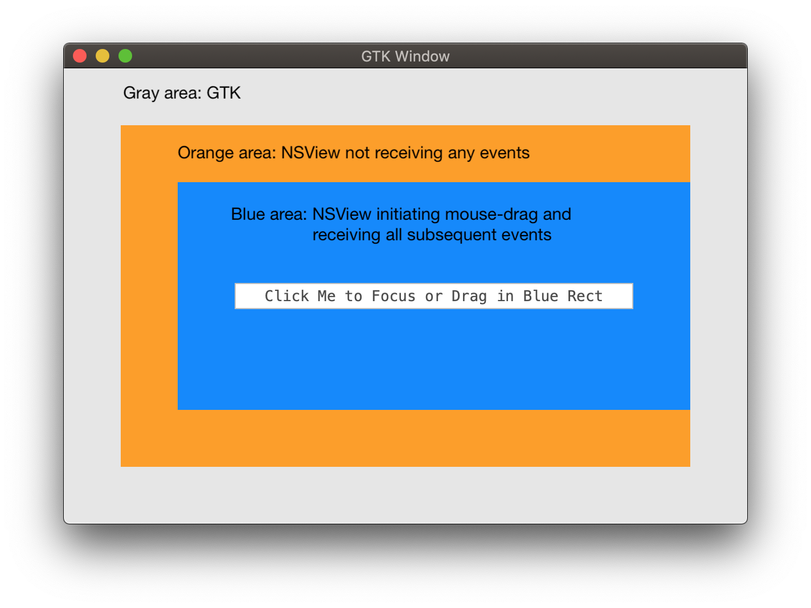

# Test Case: GDK Event loop eats `NSEvent`s

## Problem

Native embedded views do not receive events under certain circumstances.



## Scenario

When GDK is driving the event loop (that is, `Gtk.Application.Run` or similar
is in use), some events (in particular mouse-drag) are not delivered to
native views when the mouse is outside of the frame of _any_ `NSView`.

1. Start dragging the mouse inside an embedded native `NSView`.
2. Notice that the view does not receive events once the mouse drag operation
   crosses out of the native frame.
3. If the mouse crosses back into a native frame (not necessarily the
   initiating view frame), events will be delivered again.

However, when the native `CFRunLoop` is in charge (that is,
`AppKit.NSApplication.Run` or similar is in use), events are delivered as
expected.

Observe the screencast carefully below.


## Build

```bash
msbuild /restore
```

## Run

```bash
msbuild /t:Run
```